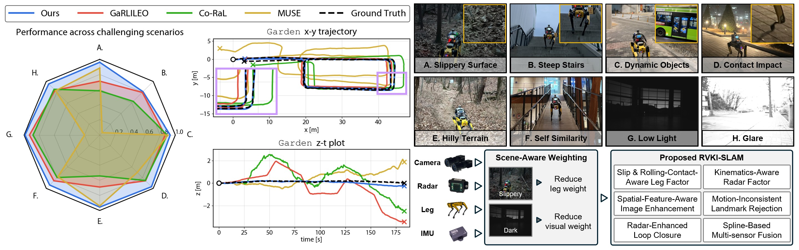
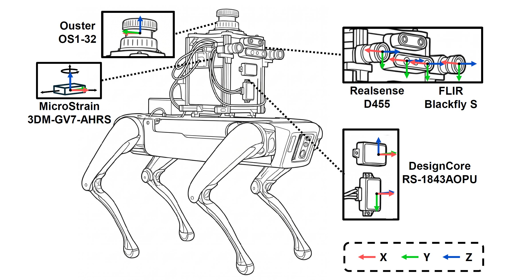

<h1 align="center"><b><em>RAGNAROK</em></b>: Radar-Aided Gravity-Normalized Alignment for Robust Open Keyframe-based Radar-Visual-Kinematic-Inertial SLAM</h1>

<p align="center">
  <a href="https://arxiv.org/pdf/2610.11531"></a>&nbsp;&nbsp;&nbsp;
  <a href="https://ragnarok-rvki-slam.github.io/RAGNAROK/"></a>&nbsp;&nbsp;&nbsp;
  <a href="https://www.youtube.com/watch?v=qD49Pis8DZ4"></a>&nbsp;&nbsp;&nbsp;
  <a href="https://docs.google.com/forms/d/e/1FAIpQLSfjRVYzPaouFmoXknAHRnoTL55A_Lar1E34QhtOMBsD06BoZQ/viewform"></a>
</p>

<h3 align="center">[IEEE RA-L 2026]</h3>

<p align="center">
  <a href="https://hanjun815.github.io/"><strong>Hanjun Kim<sup>1</sup></strong></a>
  ·
  <a href="https://chiyunnoh.github.io/"><strong>Chiyun Noh<sup>1</sup></strong></a>
  ·
  <a href="https://sangwoojung98.github.io"><strong>Sangwoo Jung<sup>1</sup></strong></a>
  ·
  <a href="https://lastflowers.github.io/"><strong>Jaehyung Jung<sup>2</sup></strong></a>
  ·
  <a href="https://scholar.google.com/citations?user=YxB2vHEAAAAJ&hl=en"><strong>Simon Boche<sup>2</sup></strong></a>
  ·
  <a href="https://mrl.ethz.ch/the-group/people/lab-members/cedric-le-gentil.html"><strong>Cédric Le Gentil<sup>3</sup></strong></a>
  ·
  <a href="https://mrl.ethz.ch/the-group/people/lab-members/stefan-leutenegger.html"><strong>Stefan Leutenegger<sup>3</sup></strong></a>
  ·
  <a href="https://ayoungk.github.io/"><strong>Ayoung Kim<sup>1†</sup></strong></a>
  <br/>
  <small><sup>1</sup>RPM Lab, Seoul National University</small> &emsp;&emsp;
  <small><sup>2</sup>MRL Lab, Technical University of Munich</small> &emsp;&emsp;
  <small><sup>3</sup>MRL Lab, ETH Zurich</small>
  <br/>
  <small><sup>†</sup>Corresponding author</small>
</p>

<p align="center">
  
</p>

<b><em>RAGNAROK</em></b> is the first radar-visual-kinematic-inertial (RVKI) SLAM for legged
robots, designed for robust operation in challenging conditions such as slippery
surfaces, steep stairs, dynamic objects, low light, and glare. It combines
slip- and rolling-contact-aware leg velocity estimation, a kinematics-aware
multi-radar factor, and degradation-aware image enhancement with
continuous-time proprioceptive fusion, scene-aware multi-sensor weighting, and
online calibration.

## News

- **2026/10/07**: RAGNAROK is accepted in IEEE RA-L 2026.
- **2026/10/08**: First release of RAGNAROK code.
- **2026/10/08**: Our project page is available via [Project](https://ragnarok-rvki-slam.github.io/RAGNAROK/).

## Dataset

### RAGNAROK Dataset

Indoor, outdoor, and mixed sequences collected with a legged robot across
diverse illumination conditions, elevation changes, self-similar structures,
and loop trajectories. All RAGNAROK modes and variants run on this dataset.

<p align="center">
  
  <br/>
  <small>System overview of the platform and coordinates of sensors.</small>
</p>

#### Sensor Specifications

| Sensor | Stereo camera | Mono camera | IMU | Legged robot | Radar | LiDAR | Laser scanner |
| --- | --- | --- | --- | --- | --- | --- | --- |
| **Model** | RealSense D455 | 2 × FLIR Blackfly S | MicroStrain 3DM-GV7-AHRS | Boston Dynamics Spot | 2 × DesignCore RS-1843AOPU | Ouster OS1-32 | Leica RTC360 |
| **Frequency** | 15 Hz | 15 Hz | 100 Hz | 150 Hz | 15 Hz | 10 Hz | – |

📂 Download: [RAGNAROK Dataset](https://docs.google.com/forms/d/e/1FAIpQLSfjRVYzPaouFmoXknAHRnoTL55A_Lar1E34QhtOMBsD06BoZQ/viewform?usp=header)

Pass the downloaded dataset root to `docker/run.sh` as described in
[Start the container](#start-the-container).

### GaRLILEO Dataset

Indoor and outdoor sequences with radar, IMU, and leg kinematics, including
motion-capture sequences, from GaRLILEO (IJRR 2026).

📂 Download: [GaRLILEO Dataset](https://docs.google.com/forms/d/e/1FAIpQLSfszKpS_At7sF-0aQxxHN9ujUyi4gdotq9ES3meqMWp2gySVw/viewform)

### Co-RaL Dataset

Sequences with chip radar, IMU, LiDAR, and Spot leg kinematics from Co-RaL
(IROS 2024).

📂 Download: [Co-RaL Dataset](https://drive.google.com/drive/folders/1mRbrhuMpDGi225rFbGVFXNfloaM93vLE)

The GaRLILEO and Co-RaL datasets have no camera, so they run with GaRLILEO alone;
see [Run on the GaRLILEO and Co-RaL datasets](#run-on-the-garlileo-and-co-ral-datasets).

## Requirements

The Docker environment targets **Linux x86-64, Ubuntu 22.04, ROS 2 Humble,
CUDA 12.1, and LibTorch 2.4.0 with the C++11 ABI**. GPU execution has been used
with an RTX 4080 SUPER.

On the host, install Docker, an NVIDIA driver compatible with CUDA 12.1,
and the [NVIDIA Container Toolkit](https://docs.nvidia.com/datacenter/cloud-native/container-toolkit/install-guide.html).
The toolkit must be configured for Docker GPU access. For RViz, an X11/XWayland
display and `xauth` are required. Headless execution is supported with `rviz:=false`.

The first Docker build downloads the dependencies and LibTorch. Allow substantial
free disk space for the image, compiler cache, model weights, and your datasets.
The default workspace build uses two compiler jobs to limit memory consumption.

## Clone

```bash
git clone https://github.com/hanjun815/RAGNAROK.git
cd RAGNAROK
```

As in OKVIS2-X, the stereo depth and segmentation models (`depth-model.pt` and
`fast-scnn.pt` in `src/Exteroceptive/resources/`) are part of the repository.
The multi-view stereo model `mvs-model.pt` (279 MB) is too large for Git, so the
first build downloads it from the OKVIS2-X model server into the same directory
and checks its SHA256; later builds reuse it. That first build needs Internet access.

## Build the Docker image

Run on the host, from the workspace root:

```bash
./docker/build.sh
```

This builds `ragnarok:humble-cu121` from `docker/Dockerfile`, using the workspace
root as the build context. It installs ROS, CUDA, LibTorch, Ceres, Sophus,
Pangolin, and the remaining build dependencies.

To change the image name or dependency-build parallelism:

```bash
RAGNAROK_IMAGE=ragnarok:humble-cu121 BUILD_JOBS=4 ./docker/build.sh
```

The dependency installation uses the default Ubuntu archive. To use a closer
mirror, pass a build argument, for example:

```bash
./docker/build.sh --build-arg UBUNTU_MIRROR=https://kr.archive.ubuntu.com/ubuntu
```

## Start the container

Pass the **directory containing the sequence directories**:

```text
/path/to/RAGNAROK_dataset/
├── Atrium/ros2_bag/metadata.yaml
├── Terrace/ros2_bag/metadata.yaml
└── ...
```

```bash
./docker/run.sh /absolute/path/to/RAGNAROK_dataset
```

The script creates a container named `ragnarok`, forwards the GPU and X11 display,
and mounts:

| Host | Container |
| --- | --- |
| Current workspace | `/root/code/RAGNAROK` |
| Supplied dataset root, read-only | `/root/code/RAGNAROK_dataset` |

The default command is an interactive Bash shell. The container is removed when
that shell exits; source, build products, and results persist in the host workspace.
It uses host networking and IPC. Use `ROS_DOMAIN_ID` to isolate simultaneous ROS runs.
For another name, set `RAGNAROK_CONTAINER`, for example:

```bash
RAGNAROK_CONTAINER=ragnarok-2 ./docker/run.sh /absolute/path/to/RAGNAROK_dataset
```

To open another terminal in the running container:

```bash
docker exec -it ragnarok bash
```

## Build the workspace

Inside the container:

```bash
cd /root/code/RAGNAROK
./build_workspace.sh
source setup_env.sh
```

The script builds bundled tiny-viewer and CTraj, then `spot_msgs`, `garlileo`,
and `okvis` in dependency order with Release optimizations. It searches only
`src`, so output directories are not mistaken for additional ROS packages.
The documented configuration builds the ROS subscriber pipeline for recorded
sensor topics; direct RealSense-device executables and standalone examples are disabled.

The default CUDA targets are SM 86 and SM 89. For another GPU supported by
CUDA 12.1, set both CMake and LibTorch architecture settings, for example:

```bash
CUDA_ARCHITECTURES=75 TORCH_CUDA_ARCH_LIST=7.5 BUILD_JOBS=2 ./build_workspace.sh
source setup_env.sh
```

After changing a launch file or installed configuration, rerun the build and
source `setup_env.sh`. `ros2 launch <package> ...` loads the installed launch
file, not the file under `src`. Config paths explicitly pointing into `src`
read those source YAML files directly on the next launch.

## Run RAGNAROK-SLAM

Inside the container, after building:

```bash
cd /root/code/RAGNAROK
source setup_env.sh
ros2 launch okvis ragnarok.launch.py \
  config_filename:=/root/code/RAGNAROK/src/Exteroceptive/config/rsD455/okvis2_SLAM.yaml \
  se_config_filename:=/root/code/RAGNAROK/src/Exteroceptive/config/rsD455/se2.yaml \
  config_path:=/root/code/RAGNAROK/src/Proprioceptive/config/RAGNAROK/config.yaml \
  rosbag_path:=/root/code/RAGNAROK_dataset/Atrium/ros2_bag
```

`okvis2_SLAM.yaml` enables loop closure and final BA. The launch starts the
GPU depth-fusion node, waits for GPU warmup and subscriber initialization, then
starts the radar-aided proprioceptive estimator and rosbag playback automatically.
When you stop the run
([Save the results](#save-the-results)), allow final optimization and trajectory
saving to finish before closing the container.

## Run RAGNAROK-Odom

```bash
cd /root/code/RAGNAROK
source setup_env.sh
ros2 launch okvis ragnarok.launch.py \
  config_filename:=/root/code/RAGNAROK/src/Exteroceptive/config/rsD455/okvis2.yaml \
  se_config_filename:=/root/code/RAGNAROK/src/Exteroceptive/config/rsD455/se2.yaml \
  config_path:=/root/code/RAGNAROK/src/Proprioceptive/config/RAGNAROK/config.yaml \
  rosbag_path:=/root/code/RAGNAROK_dataset/Atrium/ros2_bag
```

`okvis2.yaml` disables loop closure and final BA.

Change sequences through `rosbag_path`, for example
`rosbag_path:=/root/code/RAGNAROK_dataset/Terrace/ros2_bag`.
Stop the previous launch completely and restart the pipeline for each sequence.

## Run the RVI, VKI, and RKI variants

Each variant leaves out one sensor:

| Variant | Sensors | `ros2 launch` | Exteroceptive config | Proprioceptive config |
| --- | --- | --- | --- | --- |
| RVI | Radar, camera, IMU (no legs) | `okvis ragnarok_RVI.launch.py` | `okvis2_RVI.yaml` | `config_RVI.yaml` |
| VKI | Camera, leg kinematics, IMU (no radar) | `okvis ragnarok_VKI.launch.py` | `okvis2_VKI.yaml` | `config_VKI.yaml` |
| RKI | Radar, leg kinematics, IMU (no camera) | `garlileo garlileo.launch.py` | — | `config.yaml` |

- **VKI** uses both cameras, so the exteroceptive estimator runs on the depth-fusion
  node as in Odom and SLAM. `ragnarok_VKI.launch.py` starts it with the VKI configs,
  then the radar-aided proprioceptive estimator and rosbag playback once the
  exteroceptive estimator is ready:

```bash
cd /root/code/RAGNAROK
source setup_env.sh
ros2 launch okvis ragnarok_VKI.launch.py \
  config_filename:=/root/code/RAGNAROK/src/Exteroceptive/config/rsD455/okvis2_VKI.yaml \
  se_config_filename:=/root/code/RAGNAROK/src/Exteroceptive/config/rsD455/se2.yaml \
  config_path:=/root/code/RAGNAROK/src/Proprioceptive/config/RAGNAROK/config_VKI.yaml \
  rosbag_path:=/root/code/RAGNAROK_dataset/Atrium/ros2_bag
```

- **RVI** uses only the left camera, so the exteroceptive estimator runs on the VIO
  node instead of the depth-fusion node. `ragnarok_RVI.launch.py` starts it with the
  RVI configs, then the radar-aided proprioceptive estimator and rosbag playback once
  the exteroceptive estimator is ready:

```bash
cd /root/code/RAGNAROK
source setup_env.sh
ros2 launch okvis ragnarok_RVI.launch.py \
  config_filename:=/root/code/RAGNAROK/src/Exteroceptive/config/rsD455/okvis2_RVI.yaml \
  se_config_filename:=/root/code/RAGNAROK/src/Exteroceptive/config/rsD455/se2.yaml \
  config_path:=/root/code/RAGNAROK/src/Proprioceptive/config/RAGNAROK/config_RVI.yaml \
  rosbag_path:=/root/code/RAGNAROK_dataset/Atrium/ros2_bag
```

- **RKI** is the radar-aided proprioceptive pipeline alone; no exteroceptive
  process is needed:

```bash
cd /root/code/RAGNAROK
source setup_env.sh
ros2 launch garlileo garlileo.launch.py \
  config_path:=/root/code/RAGNAROK/src/Proprioceptive/config/RAGNAROK/config.yaml \
  rosbag_path:=/root/code/RAGNAROK_dataset/Atrium/ros2_bag
```

Stop RKI with **Ctrl+C**; the radar-aided proprioceptive estimator then writes the
trajectory to `results/proprioceptive/poses.txt`.

## Save the results

The pipeline keeps running after rosbag playback ends. Once playback has finished,
call the exteroceptive estimator shutdown service from another terminal in the
container, for example `docker exec -it ragnarok bash`:

```bash
cd /root/code/RAGNAROK
source setup_env.sh
ros2 service call /okvis/shutdown std_srvs/srv/SetBool "{data: true}"
```

The exteroceptive estimator then finishes its optimization (final BA in SLAM),
writes its outputs to `results/`, and exits. The launch then stops the radar-aided
proprioceptive estimator, which writes `results/proprioceptive/poses.txt`. Wait until
the launch exits. Pressing **Ctrl+C** once in the launch terminal also saves the
results; do not press it again while saving is in progress.

## Configuration and outputs

Proprioceptive config YAML files are in `src/Proprioceptive/config/`, one directory per dataset.
For the RAGNAROK dataset, `ragnarok.launch.py`, `ragnarok_RVI.launch.py`, and
`ragnarok_VKI.launch.py` select `RAGNAROK/config.yaml`, `RAGNAROK/config_RVI.yaml`,
and `RAGNAROK/config_VKI.yaml`.
Any configuration can be selected explicitly with `config_path`.

| Argument | Purpose / default |
| --- | --- |
| `config_filename` | OKVIS YAML; default is installed `rsD455/okvis2.yaml` (`okvis2_RVI.yaml` / `okvis2_VKI.yaml` for the RVI / VKI launch files). |
| `se_config_filename` | Dense mapping config; default is installed `rsD455/se2.yaml`. |
| `config_path` | GaRLILEO config; default is installed `config/RAGNAROK/config.yaml` (`config_RVI.yaml` / `config_VKI.yaml` for the RVI / VKI launch files). |
| `rosbag_path` | Sequence bag directory; specify it explicitly as in the examples. |
| `start_time` / `play_rate` | Skip the first `3.0` seconds / playback at `1.0` speed. |
| `rviz` | `true`; use `false` for headless execution. |
| `warmup_timeout` | `180.0` seconds for OKVIS startup. |
| `sigterm_timeout` | `300.0` seconds to finish final BA and saving after Ctrl+C before sending SIGTERM. Increase it for long sequences if needed. |
| `csv_path` | OKVIS outputs; default `/root/code/RAGNAROK/results`. |

All outputs are written to `results/`, which is created at runtime and excluded
from Git. The exteroceptive estimator writes its trajectory and dense-map outputs
there (`csv_path` and `results_directory` in `se2.yaml`). The radar-aided
proprioceptive estimator writes its trajectory to `results/proprioceptive/poses.txt`
(`Configor.DataStream.OutputPath` in its config), together with the online calibration
logs when they are enabled.
Each run overwrites these files, so copy them before rerunning if you need to
retain them.

Inspect the installed arguments without starting any nodes:

```bash
ros2 launch okvis ragnarok.launch.py --show-args
ros2 launch garlileo garlileo.launch.py --show-args
```

## Run in two terminals

Terminal 1, SLAM:

```bash
cd /root/code/RAGNAROK
source setup_env.sh
ros2 launch okvis okvis2x_node_subscriber.launch.xml \
  config_filename:=/root/code/RAGNAROK/src/Exteroceptive/config/rsD455/okvis2_SLAM.yaml \
  se_config_filename:=/root/code/RAGNAROK/src/Exteroceptive/config/rsD455/se2.yaml \
  depth_fusion:=true
```

For Odom, replace `okvis2_SLAM.yaml` with `okvis2.yaml`.
After Terminal 1 prints `RAGNAROK_OKVIS_READY`, run in Terminal 2:

```bash
cd /root/code/RAGNAROK
source setup_env.sh
ros2 launch garlileo garlileo.launch.py \
  config_path:=/root/code/RAGNAROK/src/Proprioceptive/config/RAGNAROK/config.yaml \
  rosbag_path:=/root/code/RAGNAROK_dataset/Atrium/ros2_bag \
  rviz:=false
```

Once playback has finished, call the exteroceptive estimator shutdown service from
a third terminal in the container, for example `docker exec -it ragnarok bash`:

```bash
cd /root/code/RAGNAROK
source setup_env.sh
ros2 service call /okvis/shutdown std_srvs/srv/SetBool "{data: true}"
```

The exteroceptive estimator then finishes its optimization (final BA in SLAM),
writes its outputs to `results/`, and exits Terminal 1. Then press **Ctrl+C** in
Terminal 2 to stop the radar-aided proprioceptive estimator, which writes
`results/proprioceptive/poses.txt`.

## Run on the GaRLILEO and Co-RaL datasets

The GaRLILEO and Co-RaL datasets have no camera, so the radar-aided proprioceptive
estimator runs alone, as in RKI. Start the container with the root of the dataset to
run, for example `./docker/run.sh /absolute/path/to/garlileo_dataset`; it is mounted
at `/root/code/RAGNAROK_dataset`.

<table>
  <tr>
    <th>Dataset</th><th>Sequences</th><th><code>ros2 launch</code></th><th>Proprioceptive config</th>
  </tr>
  <tr>
    <td rowspan="4">GaRLILEO</td><td>BridgeLoop</td>
    <td rowspan="2"><code>garlileo garlileo_garlileo.launch.py</code></td>
    <td rowspan="2"><code>GaRLILEO/GaRLILEO/config.yaml</code></td>
  </tr>
  <tr><td>SlopeStair</td></tr>
  <tr>
    <td>MoCap-E</td>
    <td rowspan="2"><code>garlileo garlileo_mocap.launch.py</code></td>
    <td rowspan="2"><code>GaRLILEO/mocap/config.yaml</code></td>
  </tr>
  <tr><td>MoCap-H</td></tr>
  <tr>
    <td rowspan="4">Co-RaL</td><td>building</td>
    <td rowspan="4"><code>garlileo garlileo_coral.launch.py</code></td>
    <td><code>Co-RaL/config_building.yaml</code></td>
  </tr>
  <tr><td>garage</td><td><code>Co-RaL/config_garage.yaml</code></td></tr>
  <tr><td>stair</td><td><code>Co-RaL/config_stair.yaml</code></td></tr>
  <tr><td>trail</td><td><code>Co-RaL/config_trail.yaml</code></td></tr>
</table>

- **GaRLILEO dataset**

  BridgeLoop (for SlopeStair, end `rosbag_path` with `SlopeStair`):

  ```bash
  cd /root/code/RAGNAROK
  source setup_env.sh
  ros2 launch garlileo garlileo_garlileo.launch.py \
    config_path:=/root/code/RAGNAROK/src/Proprioceptive/config/GaRLILEO/GaRLILEO/config.yaml \
    rosbag_path:=/root/code/RAGNAROK_dataset/BridgeLoop
  ```

  MoCap-E (for MoCap-H, end `rosbag_path` with `MoCap-H`):

  ```bash
  cd /root/code/RAGNAROK
  source setup_env.sh
  ros2 launch garlileo garlileo_mocap.launch.py \
    config_path:=/root/code/RAGNAROK/src/Proprioceptive/config/GaRLILEO/mocap/config.yaml \
    rosbag_path:=/root/code/RAGNAROK_dataset/MoCap-E
  ```

- **Co-RaL dataset**

  trail (each sequence has its own configuration, so for building, garage, or stair,
  change both `config_path` and `rosbag_path`):

  ```bash
  cd /root/code/RAGNAROK
  source setup_env.sh
  ros2 launch garlileo garlileo_coral.launch.py \
    config_path:=/root/code/RAGNAROK/src/Proprioceptive/config/Co-RaL/config_trail.yaml \
    rosbag_path:=/root/code/RAGNAROK_dataset/trail/ros2_bag
  ```

These launch files decode the foot messages recorded in those datasets
automatically. Co-RaL radar point clouds store the Doppler velocity in a `vr`
field, which the radar-aided proprioceptive estimator reads when a cloud has no
`velocity` field. Once playback has finished, press **Ctrl+C** once; the
radar-aided proprioceptive estimator then writes the trajectory to
`results/proprioceptive/poses.txt`.

## License

RAGNAROK is released under the [BSD 3-Clause License](LICENSE). Each component
keeps its own license:

| Component | Based on | License |
| --- | --- | --- |
| `src/Proprioceptive/` | [GaRLILEO](https://github.com/ChiyunNoh/GaRLILEO) and [River](https://github.com/Unsigned-Long/River) | MIT, [`LICENSE`](src/Proprioceptive/LICENSE) |
| `src/Exteroceptive/` | [OKVIS2-X](https://github.com/ethz-mrl/OKVIS2-X) | BSD 3-Clause, [`LICENSE`](src/Exteroceptive/LICENSE) |
| `src/spot_msgs/` | [SPOT_ego_Velocity](https://github.com/SangwooJung98/SPOT_ego_Velocity) | MIT, [`LICENSE`](src/spot_msgs/LICENSE) |

Bundled third-party libraries, such as CTraj and Tiny-Viewer under
`src/Proprioceptive/thirdparty/` and the libraries under `src/Exteroceptive/external/`
and `src/Exteroceptive/supereight2/`, keep the licenses included in their directories.

## Acknowledgments

The proprioceptive module (`src/Proprioceptive/`) is based on
[GaRLILEO](https://github.com/ChiyunNoh/GaRLILEO), and the exteroceptive module
(`src/Exteroceptive/`) is based on [OKVIS2-X](https://github.com/ethz-mrl/OKVIS2-X).
GaRLILEO is based on [River](https://github.com/Unsigned-Long/River).

## Citation

```bibtex
@article{kim2026ragnarok,
  title={RAGNAROK: Radar-Aided Gravity-Normalized Alignment for Robust Open Keyframe-based Radar-Visual-Kinematic-Inertial SLAM},
  author={Kim, Hanjun and Noh, Chiyun and Jung, Sangwoo and Jung, Jaehyung and Boche, Simon and Le Gentil, C{\'e}dric and Leutenegger, Stefan and Kim, Ayoung},
  journal={IEEE Robotics and Automation Letters},
  year={2026}
}
```

## Contact

If you have any questions, please contact:

- Hanjun Kim (hanjun815@snu.ac.kr)
